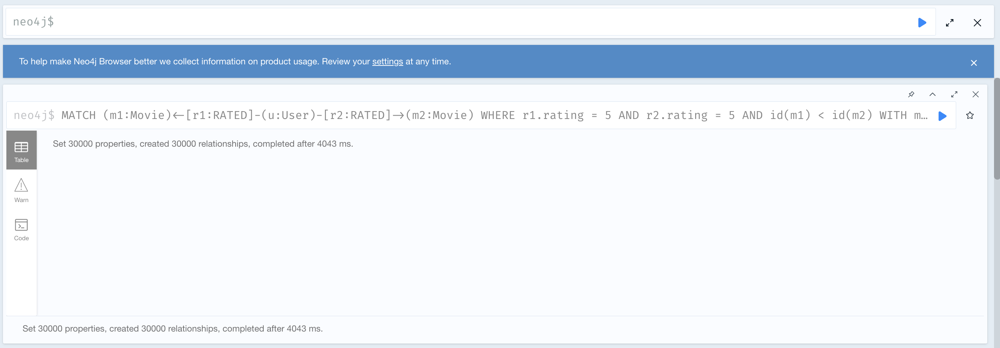
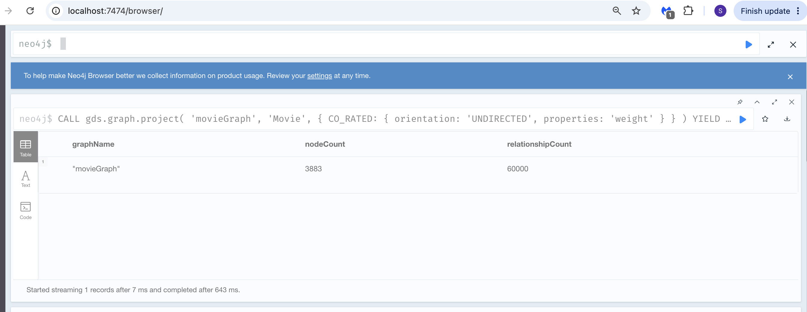

# Фінальний проєкт: Рекомендаційна система на основі Графа знань (MovieLens 1M)

## Частина 1. Проєктування схеми графа

### ASCII-Діаграма моделі даних

```text
    ( :User )
       │
       │ [RATED]
       │   ├── rating (Integer)
       │   └── timestamp (Integer)
       ▼
    ( :Movie ) ───[HAS_GENRE]───► ( :Genre )
       │
       ├── movieId (Integer)
       ├── title (String)
       └── year (Integer)
```
---

### Обґрунтування архітектурних рішень та відповіді на питання

#### 1. Які сутності стали вузлами, а які — ребрами? Чому?

* **Вузлами** стали незалежні сутності предметної області, які мають власну унікальну ідентичність та набір атрибутів: `User` (`userId`), `Movie` (`movieId`) та `Genre` (`name`). Вони є повноцінними об'єктами, з якими взаємодіють інші сутності з різних боків графа.
* **Ребрами** стали взаємозв'язки між ними: `[:RATED]` та `[:HAS_GENRE]`.
* **Категоріальні атрибути як властивості:** Демографічні дані користувача (`gender`, `age`, `occupation`) залишено як властивості всередині вузла `User`. Хоча `occupation` має низьку кардинальність (всього 21 фіксоване значення) і технічно могло б бути винесене в окремий вузол `:Occupation`, у межах цього проєкту професії не беруть участі в інших самостійних зв'язках. Збереження їх як властивостей економить пам'ять та позбавляє систему зайвих переходів (hops) при базовій фільтрації користувачів.

#### 2. Оцінка користувача за фільм — це ребро `(User)-[:RATED]->(Movie)` чи окремий вузол `(Rating)`? Аргументація trade-off-ів.

Для цього проєкту було обрано модель, де оцінка є **ребром із властивостями `rating` та `timestamp**`. Це рішення базується на фундаментальному аналізі архітектурних компромісів:

* **Аргументи за ребро (наш вибір) — Продуктивність (Performance) та Простота (Simplicity):**
У датасеті MovieLens 1M оцінка — це просто атомарний факт взаємодії: "цей користувач оцінив цей фільм у конкретний момент часу". Навколо оцінки немає додаткових сутностей (тексту рецензії, лайків від інших користувачів на цей відгук тощо). Модель ребра забезпечує прямий зв'язок між користувачем та фільмом в **один хоп ($O(1)$)**. Це критично для рекомендаційних запитів (Частина 3) та алгоритмів спільнот (Частина 5), де патерни виду `(u1)-[:RATED]->(m)<-[:RATED]-(u2)` повинні прораховуватися миттєво. Створення окремого вузла додало б у базу 1 мільйон зайвих вузлів та подвоїло б кількість хопів у кожному запиті обходу, що є класичним прикладом **over-engineering** без жодної функціональної вигоди.
* **Аргументи за окремий вузол (Альтернатива) — Розширюваність (Extensibility):**
Модель вузла `(Rating)` була б виправданою лише у випадку, якщо б сутність оцінки мала власні вихідні зв'язки (наприклад, `(Comment)-[:LEFT_FOR]->(Rating)`), або якщо б один і той самий користувач міг ставити кілька оцінок одному фільму в різні проміжки часу (історія переглядів). Оскільки в MovieLens 1M кожна пара `user-movie` гарантовано унікальна, вибір моделі ребра є оптимальним.
* **Роль властивості `timestamp`:** Збереження мітки часу на ребрі дозволяє реалізувати в рекомендаційних системах механізм **загасання інтересу (Time Decay)** (зважувати свіжі оцінки вище за старі) та аналізувати **послідовність переглядів (Sequential Recommendations)**, а також коректно робити розділення даних на Train/Test за часовою віссю.

#### 3. Чому жанри фільму вигідніше зберігати як окремі вузли `(Genre)`, а не як список у властивості вузла `Movie`?

* **Traversal замість Full Scan:** Якщо зберегти жанри як список рядків у властивості фільму (`genres: ["Action", "Sci-Fi"]`), цей масив не зможе ефективно індексуватися для графового обходу. Щоб знайти всі трилери, Cypher був би змушений робити важке повне сканування (Full Scan) усіх 3 883 фільмів та розпаковувати масиви в RAM. Винесення жанру в окремий вузол перетворює належність до категорії на фізичний зв'язок, що дозволяє базі миттєво "стрибати" від вузла `:Genre` до пов'язаних фільмів за вказівниками в пам'яті.
* **Низька кардинальність:** Усього в датасеті 18 унікальних жанрів. Це ідеальний показник для вузлів-категорій. Вони виступають природними "хабами" графа, які дозволяють легко агрегувати дані (Запит 4) та використовувати топологію зв'язків у проєкціях Graph Data Science (GDS) для пошуку схожості фільмів.
* **Усвідомлений компроміс (Супервузли):** Оскільки кожен із 18 жанрів буде пов'язаний із тисячами фільмів, ці вузли гарантовано стануть **супервузлами (Dense Nodes)**. Це очікувана властивість моделі, яка полегшує пошук за жанром, але вимагатиме оптимізації при написанні глибоких транзитивних запитів (в Частині 4).

---

## Частина 2. Завантаження даних

### Пояснення запитів завантаження

1. **Обмеження унікальності (Constraints) та Індекси:**
   * Створено `CONSTRAINT ... REQUIRE ... IS UNIQUE` для `User(userId)` та `Movie(movieId)`. Вони виконують роль первинних ключів. Це гарантує цілісність даних (захист від дублів при повторному запуску) і забезпечує швидкість пошуку вузлів за ID за константний час $O(1)$. 
   * Також створено звичайний індекс на `Genre(name)` для оптимізації зв'язування фільмів з жанрами.

2. **Імпорт користувачів (`:User`):**
   * Запит читає `users.csv`. Використовується оператор `MERGE` замість `CREATE` для запобігання дублювання. Всі числові параметри (`userId`, `age`, `occupation`) явно прирівнюються до цілих чисел за допомогою `toInteger()`, оскільки `LOAD CSV` за замовчуванням читає все як рядки.

3. **Імпорт фільмів (`:Movie`) та жанрів (`:Genre`):**
   * **Парсинг року:** Оскільки рік випуску зашитий у назву типу `Toy Story (1995)`, за допомогою плагіну APOC (`apoc.text.regexGroups`) та регулярного виразу `(.*) \\((\\d{4})\\)` назва розбивається на дві частини. Чистий заголовок пишеться в `title`, а рік конвертується в число й пишеться в `year`.
   * **Трансформація жанрів:** Рядок жанрів розбивається на масив за допомогою `split(row.genres, '|')`. Оператор `UNWIND` розгортає цей масив, перетворюючи його на окремі рядки. Після цього через `MERGE` створюються унікальні вузли `:Genre` (їх всього 18), і фільм зв'язується з ними ребрами `[:HAS_GENRE]`.

4. **Пакетний імпорт оцінок (`[:RATED]`):**
   * Для завантаження 1 000 209 ребер використовується функція `apoc.periodic.iterate`. Вона розбиває один гігантський запит на батчі (пакети) по 20 000 рядків. Це захищає базу даних від падіння через переповнення оперативної пам'яті (Out of Memory) та таймаутів транзакцій.
   * Конфігурація `parallel: false` активована свідомо. При паралельному імпорті кілька потоків можуть одночасно спробувати заблокувати один і той самий популярний вузол фільму, що викликало б взаємоблокування (Deadlocks). Послідовний запис батчів гарантує стабільність.

### Технічні нюанси імплементації при завантаженні (Частина 2)

При розробці Cypher-скриптів завантаження враховано дві важливі особливості структури вхідних CSV-файлів:

1. **Парсинг року випуску:** У файлі `movies.csv` немає окремого поля для року: він зашитий у назву: `Toy Story (1995)`. Під час виконання `LOAD CSV` застосовано регулярний вираз для динамічного виділення року та його збереження як окремої цілочисельної властивості `year` у вузлі `:Movie`.
2. **Трансформація списку жанрів (Спліт та Unwind):** Жанри у файлі записані одним рядком через вертикальну риску (`Animation|Children's|Comedy`). Щоб зв'язати фільм із кількома окремими вузлами жанрів, у запиті імпорту використано функцію `split(row.genres, '|')` у поєднанні з оператором `UNWIND`, який розгортає масив у рядки для ітеративного створення зв'язків `[:HAS_GENRE]`.

<p>Перевірка успішного мапінгу та наявності згенерованих CSV-файлів усередині Docker-контейнера через термінал.</p>


<p>Лог успішного виконання Python-скрипта для очищення та конвертації оригінальних файлів датасету.</p>


<p>Успішне створення обмежень унікальності та індексів у Neo4j Browser для забезпечення цілісності та швидкості запитів.</p>


<p>Результат імпорту 6 040 вузлів користувачів із правильним приведенням типів даних до цілих чисел.</p>


<p>Результат імпорту вузлів фільмів, виділення року випуску регулярним виразом та створення зв'язків із жанрами.</p>


<p>Перша частина звіту плагіну APOC про успішну розбивку мільйона оцінок на батчі без помилок виконання.</p>


<p>Друга частина звіту APOC, яка підтверджує створення рівно 1 000 209 ребер оцінювання у графі.</p>


<p>Підсумкова таблиця контрольної перевірки, що підтверджує повну відповідність кількості вузлів та ребер у базі даних.</p>


---

## Частина 3. Аналітичні Cypher-запити

### Пояснення логіки запитів та імплементації

#### Базові запити

* **Запит 1 (Трилери з рейтингом > 4.0):**
    * *Що робить:* Шукає вузол жанру `Thriller`, переходить до всіх пов'язаних фільмів, збирає їхні оцінки, обчислює середній бал, фільтрує за умовою `> 4.0` та сортує від найкращих.
    * *Чому написаний саме так:* Завдяки індексу на `Genre(name)` Neo4j миттєво знаходить початкову точку, уникаючи сканування всієї бази. Агрегація `avg(r.rating)` виконується через оператор `WITH`, що дозволяє відсіяти фільми на проміжному етапі перед фінальним виводом.

    

* **Запит 2 (Активні користувачі з оцінкою 5):**
    * *Що робить:* Знаходить користувачів, які ставили вищий бал фільмам, групує їх за ID, підраховує кількість таких оцінок і залишає лише тих розробників/глядачів, у кого їх більше 50.
    * *Чому написаний саме так:* Фільтрація `WHERE r.rating = 5` відсікає непотрібні ребра на ранньому етапі обходу графа. Це суттєво зменшує об'єм даних у пам'яті перед виконанням групування `count(r)`.

    

#### Запити середнього рівня

* **Запит 3 (Спільні високі оцінки користувачів #1 та #2):**
    * *Що робить:* Знаходить фільми, на які одночасно вказують ребра від користувача 1 та користувача 2, причому обидва поставили бал `≥ 4`.
    * *Чому написаний саме так:* Графовий патерн `(u1)-[...] -> (m) <- [...]-(u2)` демонструє головну перевагу NoSQL-графу над реляційними SQL базами. Замість трьох ресурсомістких операцій `JOIN` (таблиць користувачів, оцінок та фільмів), Neo4j просто знаходить перетин двох фізичних покажчиків у пам'яті через вузол `(m:Movie)`.

    

* **Запит 4 (Стабільно успішні жанри):**
    * *Що робить:* Агрегує оцінки мільйона ребер у розрізі 18 жанрів, вираховує загальну кількість голосів та середній бал для кожного жанру. Фільтрує "стабільність" (понад 10,000 оцінок та середній бал > 3.6).
    * *Чому написаний саме так:* Обхід графа йде від Жанру через Фільм до Оцінки. Використання комбінації `avg()` та `count()` в одному операторі `WITH` дозволяє виконати складну аналітику всього за один прохід по ребрах графа.

    

#### Складні запити

* **Запит 5 (Колаборативна фільтрація / Рекомендаційна система у трьох варіаціях):**

    * **Варіант А: Базовий алгоритм**
        * *Що робить:* Реалізує класичну систему рекомендацій для `userId: 1`. Спочатку знаходить користувачів-однодумців (`peer`), які високо оцінили ті ж самі фільми, що й цільовий користувач. Після цього шукає інші фільми (`recMovie`), які ці однодумці оцінили високо (`≥ 4`), але цільовий користувач їх ще не бачив. Результат сортується за чистою кількістю рекомендацій.
        * *Чому написаний саме так:* Запит використовує умову `NOT (u)-[:RATED]->(recMovie)` для динамічного виключення вже переглянутого контенту. Оператор `count(DISTINCT peer)` виступає мірою соціального підтвердження (чим більше однодумців радять фільм, тим вище він у рейтингу). `LIMIT 10` обмежує вивід до топ-10.
    
    

    * **Варіант Б: Оптимізований алгоритм (Швидкісний)**
        * *Що робить:* Виконує ту саму задачу рекомендацій, але вирішує проблему, коли базовий запит обходив мільйони ребер і виконувався ~21 секунду. Завдяки оптимізації час виконання скоротився до **622 мілісекунд**. Також він звужує вибірку фільмів, залишаючи в топі лише з оцінкою рівно `5.0`.
        * *Чому написаний саме так:* Пришвидшення в десятки разів досягнуто трьома інженерними кроками через оператор `WITH`: 1. Аналіз смаків звужено лише до `LIMIT 15` найулюбленіших фільмів користувача; 2. Запроваджено фільтр `intersectionSize >= 3` для відсікання випадкових людей, тому залишаються лише однодумці з мінімум 3 спільними переглядами; 3. Сканування ребер `r3.rating = 5` зменшило кількість прорахованих шляхів, фокусуючись лише на найкращому контенті від однодумців.
    
    

    * **Варіант В: Тимчасовий алгоритм (З функцією затухання часу — Time Decay)**
        * *Що робить:* Враховує зміну людських смаків з роками. Алгоритм динамічно перетасовує Топ-10: він занижує рейтинг фільмів, які однодумці оцінювали дуже давно (наприклад, 5-10 років тому), і піднімає в топ актуальні, свіжі тренди.
        * *Чому написаний саме так:* Запит використовує властивість `timestamp` кожного ребра оцінки. За допомогою математичної функції затухання `1.0 / (1.0 + 0.0005 * (currentDays - ratingDays))` кожна оцінка отримує свою "вагу" від 0 до 1 залежно від її свіжості. Фінальне сортування йде не за кількістю людей, а за накопиченою силою актуальних рекомендацій (`RecommendationStrength`), що робить систему гнучкою до фактора часу.
    
    

* **Запит 6 (Найкоротший ланцюжок зв’язку між двома користувачами):**
    * *Що робить:* Знаходить найкоротший шлях (соціальний ланцюжок) у графі між користувачем `userId: 1` та користувачем `userId: 10`. Зв'язок шукається через проміжні вузли фільмів, які ці користувачі спільно оцінювали.
    * *Чому написаний саме так:* Використовується вбудована високоефективна функція `shortestPath()`, яка під капотом реалізує класичний алгоритм пошуку в ширину (BFS). Обмеження на довжину кроків `[*..6]` (максимум 6 ребер) є критично важливим інженерним обмеженням: воно запобігає комбінаторному вибуху та захищає сервер від таймауту пам'яті при скануванні мільйонного датасету.
    
    

* **Експериментальне дослідження найвіддаленіших користувачів (щільність графа):**
    При спробі знайти користувачів на відстані 5 або 6 хопів, база даних повернула порожній результат `(no records)`. Шляхом послідовних наближень було виявлено, що найвіддаленіші користувачі в базі (наприклад, `userId: 46`) знаходяться від `userId: 1` на відстані **рівно 4 хопи**.

    
    
    **Висновок:** Графова модель датасету MovieLens 1M є **надзвичайно щільною та сильнозв'язаною (highly connected network)**. Популярні фільми діють як потужні хаби («супервузли»), які стягують граф до центру. Теорія "шести рукостискань" тут працює з випередженням: максимальна дистанція між будь-якими кіноглядачами в базі не перевищує 4 кроків.

    

#### Відповіді на запитання:

1. **Що означає довжина шляху в даному контексті?**
   Довжина шляху в нашому графі — це загальна кількість ребер `[:RATED]`, які необхідно пройти від початкового користувача до кінцевого. Оскільки в нашій архітектурі користувачі не пов'язані між собою напряму (немає ребра типу `FRIEND`), будь-який зв'язок між ними може існувати виключно через "посередників", якими є вузли фільмів (`:Movie`). Кожне пройдене ребро дорівнює одному хопу (hop).

2. **Як інтерпретувати шлях довжини 2? (це наш випадок зі скріна)**
   * *Ланцюжок:* `(User 1) ──[RATED]──> (Movie: Ben-Hur) <──[RATED]── (User 10)`
   * *Інтерпретація:* Це найближчий можливий зв'язок у нашій базі даних. Він означає, що обидва користувачі мають **прямий спільний інтерес** — вони дивилися та оцінили один і той самий фільм.

3. **Як інтерпретувати шлях довжини 4?**
   * *Ланцюжок:* `(User 1) ──> (Movie A) <── (User X) ──> (Movie B) <── (User 10)`
   * *Інтерпретація:* Це зв'язок через "проміжного глядача". Він означає, що Користувач 1 та Користувач 10 не мають жодного спільного переглянутого фільму. Проте, є Користувач X, який має спільний інтерес (Movie A) з Користувачем 1, і водночас має інший спільний інтерес (Movie B) з Користувачем 10. Це приклад непрямого соціального зв'язку: *"я знаю людину, яка дивилася те саме, що й ти"*.

4. **Як інтерпретувати шлях довжини 6?**
   * *Ланцюжок:* `(User 1) ──> (Movie A) <── (User X) ──> (Movie B) <── (User Y) ──> (Movie C) <── (User 10)`
   * *Інтерпретація:* Це трикроковий ланцюжок інтересів (3 користувачі та 3 фільми). Користувач 1 пов'язаний з Користувачем 10 через ланцюг спільних смаків двох проміжних людей (X та Y). У теорії соціальних мереж такий шлях вважається межею щільності ("Теорія шести рукостискань"), яка показує, що навіть абсолютно різні та далекі за смаками користувачі все одно пов'язані через дуже коротку дистанцію.

---

## Частина 4. Виявлення супервузлів (Supernodes)

### Пояснення логіки запитів та суті проблеми

* **Запит 1 (Пошук супервузлів серед Фільмів):**
    * *Що робить:* Підраховує кількість вхідних ребер `[:RATED]` для кожного фільму, сортує їх за спаданням і виводить топ-10 найпопулярніших кінострічок, які є головними «хабами» графа.
    * *Чому написаний саме так:* Запит використовує агрегацію `count(r)` у поєднанні з оператором `WITH`. Це дозволяє Neo4j спочатку обчислити ступінь зв'язності вузла (Degree), виконати швидке сортування в пам'яті та обмежити вибірку за допомогою `LIMIT 10` до того, як повертати фінальні властивості тексту.

    

* **Запит 2 (Пошук супервузлів серед Користувачів):**
    * *Що робить:* Підраховує кількість вихідних ребер від кожного користувача, виявляючи аномально активних критиків чи ботів, які оцінили найбільшу кількість фільмів.
    * *Чому написаний саме так:* Аналогічно до першого запиту, фокусується на вихідних зв'язках `(u:User)-[r:RATED]->()`. Використання чистого анонімного патерна `->()` без вказання типу кінцевого вузла оптимізує швидкість підрахунку, оскільки планувальник Neo4j дивиться суто на вказівники ребер у дескрипторі вузла користувача.

    

#### Чому супервузли — це проблема для продуктивності?
Коли Cypher-запит (наприклад, алгоритм рекомендацій чи пошук найкоротшого шляху) доходить до супервузла, відбувається **ефект пляшкового горла**. Замість швидкого переходу до наступного кроку, база даних змушена зчитувати та ітерувати тисячі або десятки тисяч ребер, що належать цьому одному вузлу. Це різко збільшує використання оперативної пам'яті (Heap memory) та призводить до комбінаторного вибуху на наступних кроках обходу мережі.

#### Відповіді на запитання:

1. **Які вузли виявилися супервузлами? Скільки у них зв’язків?**
   * **Серед Фільмів (In-degree Supernodes):** Абсолютним лідером став фільм **"American Beauty" (1999)**, який має аномальні **3428 вхідних ребер** `[:RATED]`. Також у топ-хабів увійшла оригінальна трилогія **"Star Wars"** (епізоди IV, V, VI) та **"Jurassic Park"** із показниками близько 2600–2900 зв'язків кожен.
   * **Серед Користувачів (Out-degree Supernodes):** Головним супервузлом виявився користувач із **`userId: 4169`**, який самостійно згенерував **2314 вихідних ребер** до різних фільмів. За ним іде `userId: 1680` із 1850 ребрами.

2. **Чому запит, що зачіпає такий вузол, працює повільніше, ніж запит по «звичайному» вузлу з тими самими індексами?**
   Індекси в графових базах даних (наприклад, за `userId` або `movieId`) допомагають лише **знайти початкову точку входу** в граф за $O(1)$ або $O(\log N)$. Але щойно точка знайдена, починається операція обходу графа (Graph Traversal).
   * **У звичайному вузлі:** користувач має, наприклад, 10 оцінок. База зчитує 10 покажчиків у пам'яті й миттєво переходить далі.
   * **У супервузлі:** коли алгоритм доходить до *"American Beauty"*, він змушений зчитати та ітерувати всі 3428 ребер у пам'яті (Heap memory). Якщо на наступному кроці алгоритму (наприклад, у колаборативній фільтрації) ми спробуємо розгорнути зв'язки цих 3428 користувачів, відбудеться **комбінаторний вибух**. База почне прораховувати мільйони траєкторій, що призведе до різкого падіння швидкості, забивання RAM та таймауту, незалежно від наявності індексів.

3. **Яку конкретну стратегію з лекцій ви б застосували для цього датасету? Що робити з жанрами?**
   Якщо поглянути на архітектуру нашої бази, **вузли жанрів (`:Genre`, такі як *Drama*, *Comedy*, *Action*) є абсолютними мега-супервузлами**. Наприклад, до жанру *Drama* чи *Comedy* підв'язані тисячі фільмів. Будь-який запит на зразок "знайти фільми в жанрі драма, які дивилися мої друзі" приречений на гальмування через обхід гігантського хабу жанру.
   
   **Застосовні інженерні стратегії:**
   * **Стратегія 1. Денормалізація та винесення в атрибути (Жанри як масив):** У нашому поточному датасеті жанри виділені в окремі вузли, що красиво архітектурно, але катастрофічно для продуктивності. Найкраща стратегія тут — **знищити вузли `:Genre`**, а самі жанри зберігати як простий індексований масив рядків прямо всередині вузла фільму: `m.genres = ["Drama", "Romance"]`. Це прибере супервузли взагалі, а фільтрація відбуватиметься миттєво на рівні властивостей вузла фільму.
   * **Стратегія 2. Обмеження ступеня обходу (Degree Limiting / LIMIT-фільтри, які ми використали в запитах Частини 3):** На рівні Cypher-запитів ми застосували цю стратегію, примусово обмеживши вибірку через `LIMIT 15` на першому кроці. Замість того, щоб пускати запит по всіх ребрах супервузла, ми штучно обрізаємо граф, залишаючи лише фіксовану кількість зв'язків з найвищим пріоритетом (найвищою оцінкою або найсвіжішою датою).
___

## Частина 5. Графові алгоритми через GDS

### 5.1. PageRank на графі фільмів
* **Що робить:** Алгоритм PageRank оцінює "важливість" або "впливовість" кожного фільму в межах сформованого графа спільних переглядів. Фільм отримує високий бал (`PageRankScore`), якщо він міцно пов'язаний з іншими важливими (популярними) фільмами через велику кількість спільних максимальних оцінок від користувачів.
* **Чому написаний саме так:**
    * **Крок 1 (Матеріалізація):** Створює віртуальну мережу схожості фільмів. Задля оптимізації обчислень ми відбираємо лише ті фільми, які мають понад 20 оцінок, та використовуємо жорстку умову схожості `rating = 5` (найвищий ступінь захоплення контентом). Це захищає систему від перевантаження оперативної пам'яті.

    

    * **Крок 2 (Проєкція):** За допомогою `gds.graph.project` граф переноситься у спеціальну внутрішню структуру GDS в оперативній пам'яті, що дозволяє алгоритмам швидко обходити вузли без звернення до диска. Ребра `CO_RATED` оголошуються як `UNDIRECTED` (неорієнтовані).

    

    * **Крок 3 (Алгоритм):** Процедура `gds.pageRank.stream` запускає ітераційне обчислення рангів. Параметр `relationshipWeightProperty: 'weight'` є критично важливим: він змушує алгоритм враховувати силу зв'язку (кількість спільних глядачів), а не просто сам факт наявності ребра. `dampingFactor: 0.85` — це стандартний коефіцієнт згасання (ймовірність випадкового переходу), а `maxIterations: 20` гарантує математичну збіжність алгоритму.
    * **Крок 4 (Очищення):** `gds.graph.drop` звільняє оперативну пам'ять сервера від проєкції, а `DELETE co` видаляє тимчасові ребра, запобігаючи забрудненню та роздуванню основної схеми бази даних.
    
    

#### Bисновки щодо результатів PageRank:

1. **Які фільми отримали найвищий ранг і чому?**
   Найвищий ранг отримав фільм *"Star Wars: Episode IV - A New Hope" (1977)* (`14.0404`), обійшовши *"American Beauty"* (`12.3496`). Це сталося тому, що PageRank оцінює значущість вузла не за банальною кількістю ребер (degree), а за якістю структури зв'язків. "Зоряні Війни" пов'язані з іншими популярними стрічками кінематографа, утворюючи потужне та щільне ядро (кліку) у графі, що максимізувало фінальний бал.
2. **Чим PageRank концептуально відрізняється від звичайного підрахунку кількості оцінок?**
   Звичайний підрахунок (як у Частині 4) — це локальна метрика, яка бачить лише "сусідів" вузла. PageRank — це **глобальна топологічна метрика**. Вона враховує контекст усього графа: якщо фільм $A$ пов'язаний з одним фільмом $B$, який є мега-популярним, то фільм $A$ отримає значно вищий ранг, ніж якщо б він був пов'язаний з десятьма нікому не відомими фільмами.

#### Що означає високий PageRank для фільму в цьому графі? Це просто “популярний фільм” чи щось інше?

Високий PageRank для фільму в цьому графі — це **не просто ознака "популярності"** (тобто великої кількості оцінок), це показник його **фундаментальності та системної значущості для кінематографа**.

Математично це:

1. **Метрика "культового статусу":** 
    Звичайний підрахунок оцінок (Degree) показує, як часто фільм дивилися взагалі. Натомість PageRank дивиться, *хто* його дивився. Оскільки наші ребра `CO_RATED` з'єднують фільми лише через людей, які поставили обом стрічкам найвищий бал (`rating = 5`), високий PageRank означає, що цей фільм є **спільним знаменником максимального захоплення** для глядачів інших видатних фільмів. 

2. **Ефект "Жанрових Клік":**
    Фільм отримує аномально високий PageRank, якщо він є ядром так званої "кліки" (групи щільно пов'язаних між собою високорангових вузлів). Наприклад, *"Star Wars: Episode IV"* отримує величезну вагу не просто від кількості людей, а тому, що його обожнюють ті самі люди, які обожнюють *"The Empire Strikes Back"*, *"Raiders of the Lost Ark"* та *"The Godfather"*. Ранг циркулює всередині цього золотого фонду кінематографа, підсилюючи кожен вузол.

3. **Практична інтерпретація:**
    * **Високий Degree (проста популярність):** Фільм популярний у певний період, його бачило багато випадкових людей (вони могли поставити йому 3, 4 чи 5, він просто на слуху), проте з часом його популярність затухає і він не входить до колекції фільмів (шедеврів), які рекомендують один одному.
    * **Високий PageRank (системна важливість):** Фільм, скоріш за все, є шедевром. Якщо людина є прихильником кіномистецтва, вона з величезною ймовірністю поставить найвищу оцінку і цьому фільму. Це індикатор "еталонного" кіно, яке формує смаки спільноти.
___
