# Фінальний проєкт: Рекомендаційна система на основі Графа знань (MovieLens 1M)

## Частина 1. Проєктування схеми графа

### ASCII-Діаграма моделі даних

```text
    ( :User )
       │
       │ [RATED]
       │   ├── rating (Integer)
       │   └── timestamp (Integer)
       ▼
    ( :Movie ) ───[HAS_GENRE]───► ( :Genre )
       │
       ├── movieId (Integer)
       ├── title (String)
       └── year (Integer)
```
---

### Обґрунтування архітектурних рішень та відповіді на питання

#### 1. Які сутності стали вузлами, а які — ребрами? Чому?

* **Вузлами** стали незалежні сутності предметної області, які мають власну унікальну ідентичність та набір атрибутів: `User` (`userId`), `Movie` (`movieId`) та `Genre` (`name`). Вони є повноцінними об'єктами, з якими взаємодіють інші сутності з різних боків графа.
* **Ребрами** стали взаємозв'язки між ними: `[:RATED]` та `[:HAS_GENRE]`.
* **Категоріальні атрибути як властивості:** Демографічні дані користувача (`gender`, `age`, `occupation`) залишено як властивості всередині вузла `User`. Хоча `occupation` має низьку кардинальність (всього 21 фіксоване значення) і технічно могло б бути винесене в окремий вузол `:Occupation`, у межах цього проєкту професії не беруть участі в інших самостійних зв'язках. Збереження їх як властивостей економить пам'ять та позбавляє систему зайвих переходів (hops) при базовій фільтрації користувачів.

#### 2. Оцінка користувача за фільм — це ребро (User)-[:RATED]->(Movie) чи окремий вузол (Rating)? Аргументуйте своє рішення. Це не риторичне запитання: в обох підходів є реальні trade-off-и.

Для цього проєкту ми обрали модель, де оцінка є ребром із властивостями `rating` та `timestamp`. 

Рішення базується на простому компромісі між продуктивністю та складністю. У нашому датасеті оцінка — це атомарний факт: конкретна людина оцінила конкретний фільм. Навколо цієї дії немає додаткових даних (наприклад, тексту рецензії чи лайків від інших користувачів). Тому збереження оцінки як ребра забезпечує прямий зв'язок між користувачем та фільмом. Це дуже допомагає під час побудови рекомендацій, бо базі не треба робити зайвих переходів через проміжні вузли.

Окремий вузол `(Rating)` мав би сенс лише тоді, коли б сама оцінка обростала новими зв'язками, або якби користувач міг ставити кілька оцінок одному фільму в різні роки. Оскільки кожна пара "користувач-фільм" тут унікальна, ребро є найпростішим і найшвидшим варіантом.

Також варто зазначити роль властивості `timestamp`. Вона зберігається прямо на ребрі, що дозволяє нам надалі враховувати час (наприклад, надавати більшу вагу свіжим оцінкам) без ускладнення загальної схеми.

#### 3. Чому жанри фільму вигідніше зберігати як окремі вузли `(Genre)`, а не як список у властивості вузла `Movie`?

Якщо зберегти жанри як список рядків у властивості фільму (`genres: ["Action", "Sci-Fi"]`), цей масив не зможе ефективно індексуватися для графового обходу. Щоб знайти всі трилери, Cypher був би змушений робити важке повне сканування (Full Scan) усіх фільмів та розпаковувати масиви в RAM. Винесення жанру в окремий вузол перетворює належність до категорії на фізичний зв'язок, що дозволяє базі миттєво "стрибати" від вузла `:Genre` до пов'язаних фільмів за вказівниками в пам'яті.

Жанри в нашому дата-сеті мають такі властивості, які впливають на запити, що ми виконуємо зними в інших завданнях:
* **Низька кардинальність:** Усього в датасеті 18 унікальних жанрів. Це ідеальний показник для вузлів-категорій. Вони виступають природними "хабами" графа, які дозволяють легко агрегувати дані  та використовувати топологію зв'язків у проєкціях Graph Data Science (GDS) для пошуку схожості фільмів.
* **Супервузли:** Оскільки кожен із 18 жанрів буде пов'язаний із тисячами фільмів, ці вузли гарантовано стануть супервузлами. Це очікувана властивість моделі, яка полегшує пошук за жанром, але вимагатиме оптимізації при написанні глибоких транзитивних запитів.

---

## Частина 2. Завантаження даних

### Пояснення запитів завантаження

1. **Обмеження унікальності (Constraints) та Індекси:**
   * Створено `CONSTRAINT ... REQUIRE ... IS UNIQUE` для `User(userId)` та `Movie(movieId)`. Вони виконують роль первинних ключів. Це гарантує цілісність даних (захист від дублів при повторному запуску) і забезпечує швидкість пошуку вузлів за ID за константний час $O(1)$. 
   * Також створено звичайний індекс на `Genre(name)` для оптимізації зв'язування фільмів з жанрами.

2. **Імпорт користувачів (`:User`):**
   * Запит читає `users.csv`. Використовується оператор `MERGE` замість `CREATE` для запобігання дублювання. Всі числові параметри (`userId`, `age`, `occupation`) явно прирівнюються до цілих чисел за допомогою `toInteger()`, оскільки `LOAD CSV` за замовчуванням читає все як рядки.

3. **Імпорт фільмів (`:Movie`) та жанрів (`:Genre`):**
   * Оскільки рік випуску зашитий у назву типу `Toy Story (1995)`, за допомогою плагіну APOC (`apoc.text.regexGroups`) та регулярного виразу `(.*) \\((\\d{4})\\)` назва розбивається на дві частини. Чистий заголовок пишеться в `title`, а рік конвертується в число й пишеться в `year`.
   * Рядок жанрів розбивається на масив за допомогою `split(row.genres, '|')`. Оператор `UNWIND` розгортає цей масив, перетворюючи його на окремі рядки. Після цього через `MERGE` створюються унікальні вузли `:Genre` (їх всього 18), і фільм зв'язується з ними ребрами `[:HAS_GENRE]`.

4. **Пакетний імпорт оцінок (`[:RATED]`):**
   * Для завантаження 1 000 209 ребер використовується функція `apoc.periodic.iterate`. Вона розбиває один гігантський запит на батчі (пакети) по 20 000 рядків. Це захищає базу даних від падіння через переповнення оперативної пам'яті (Out of Memory) та таймаутів транзакцій.
   * Конфігурація `parallel: false` активована свідомо. При паралельному імпорті кілька потоків можуть одночасно спробувати заблокувати один і той самий популярний вузол фільму, що викликало б взаємоблокування. Послідовний запис батчів гарантує стабільність.

<p>Перевірка успішного мапінгу та наявності згенерованих CSV-файлів усередині Docker-контейнера через термінал.</p>
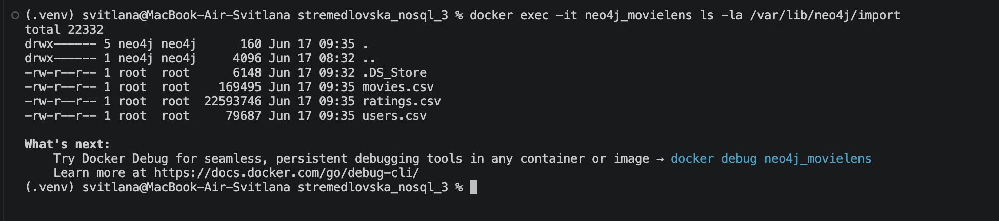

<p>Лог успішного виконання Python-скрипта для очищення та конвертації оригінальних файлів датасету.</p>
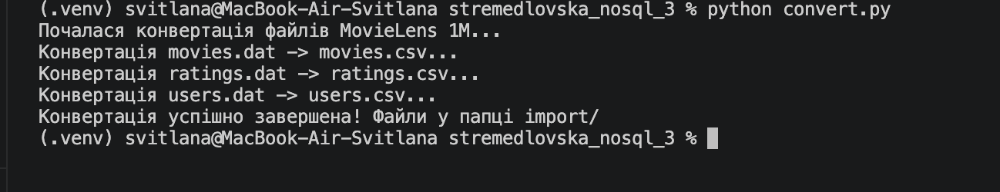

<p>Успішне створення обмежень унікальності та індексів у Neo4j Browser для забезпечення цілісності та швидкості запитів.</p>


<p>Результат імпорту 6 040 вузлів користувачів із правильним приведенням типів даних до цілих чисел.</p>
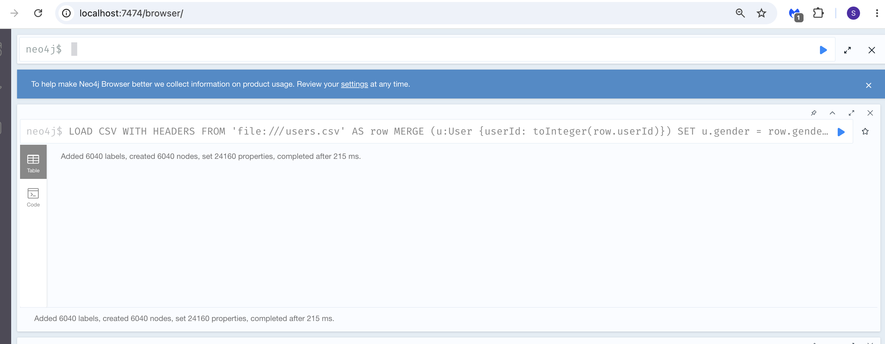

<p>Результат імпорту вузлів фільмів, виділення року випуску регулярним виразом та створення зв'язків із жанрами.</p>
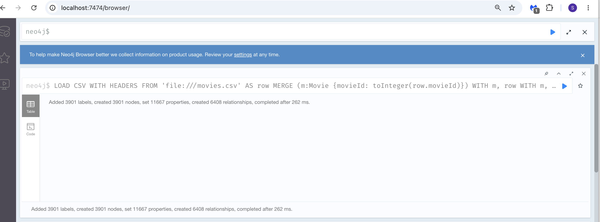

<p>Перша частина звіту плагіну APOC про успішну розбивку мільйона оцінок на батчі без помилок виконання.</p>
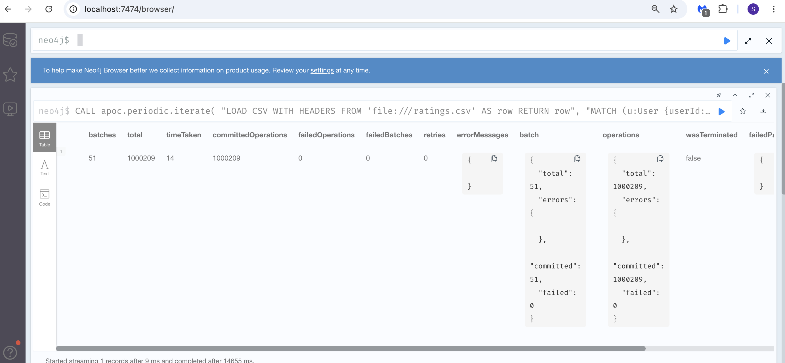

<p>Друга частина звіту APOC, яка підтверджує створення рівно 1 000 209 ребер оцінювання у графі.</p>
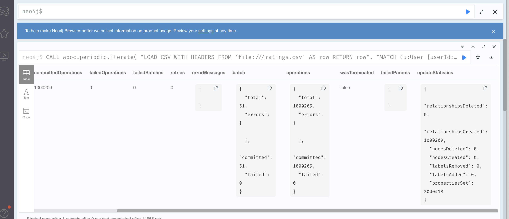

<p>Підсумкова таблиця контрольної перевірки, що підтверджує повну відповідність кількості вузлів та ребер у базі даних.</p>
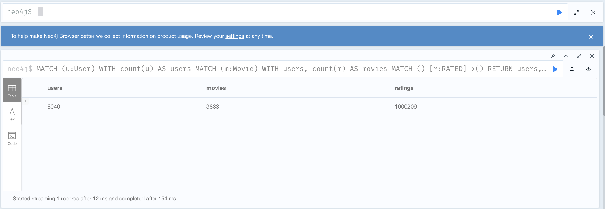

---

## Частина 3. Аналітичні Cypher-запити

### Пояснення логіки запитів та імплементації

#### Базові запити

* **Запит 1 Трилери з рейтингом > 4.0:**
    * Шукає вузол жанру `Thriller`, переходить до всіх пов'язаних фільмів, збирає їхні оцінки, обчислює середній бал, фільтрує за умовою `> 4.0` та сортує від найкращих.
    * Завдяки індексу на `Genre(name)` Neo4j миттєво знаходить початкову точку, уникаючи сканування всієї бази. Агрегація `avg(r.rating)` виконується через оператор `WITH`, що дозволяє відсіяти фільми на проміжному етапі перед фінальним виводом.

    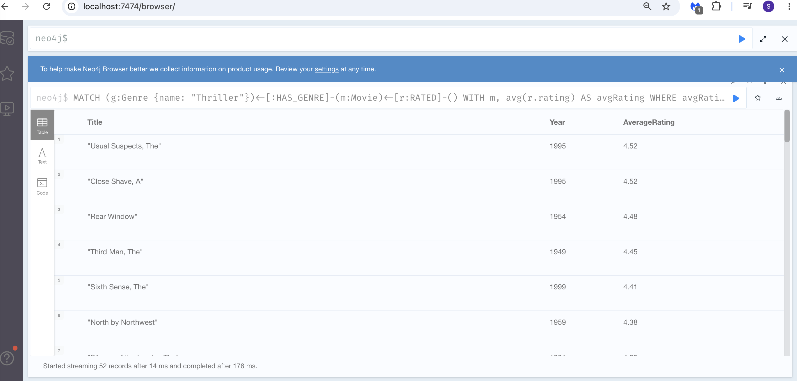

* **Запит 2 Активні користувачі з оцінкою 5:**
    * Знаходить користувачів, які ставили вищий бал фільмам, групує їх за ID, підраховує кількість таких оцінок і залишає лише тих розробників/глядачів, у кого їх більше 50.
    * Фільтрація `WHERE r.rating = 5` відсікає непотрібні ребра на ранньому етапі обходу графа. Це суттєво зменшує об'єм даних у пам'яті перед виконанням групування `count(r)`.

    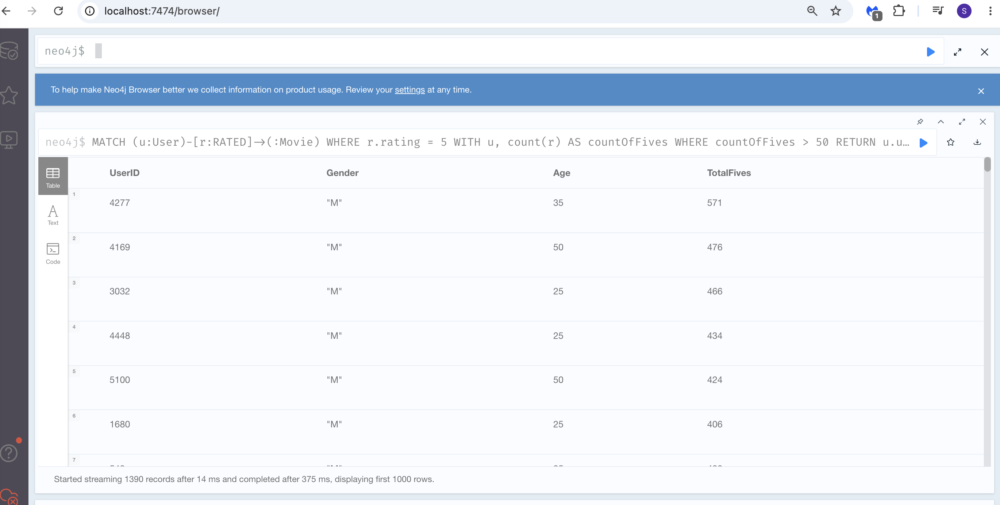

#### Запити середнього рівня

* **Запит 3 Спільні високі оцінки користувачів #1 та #2:**
    * Знаходить фільми, на які одночасно вказують ребра від користувача 1 та користувача 2, причому обидва поставили бал `≥ 4`.
    * Графовий патерн `(u1)-[...] -> (m) <- [...]-(u2)` демонструє головну перевагу NoSQL-графу над реляційними SQL базами. Замість трьох ресурсомістких операцій `JOIN` (таблиць користувачів, оцінок та фільмів), Neo4j просто знаходить перетин двох фізичних покажчиків у пам'яті через вузол `(m:Movie)`.

    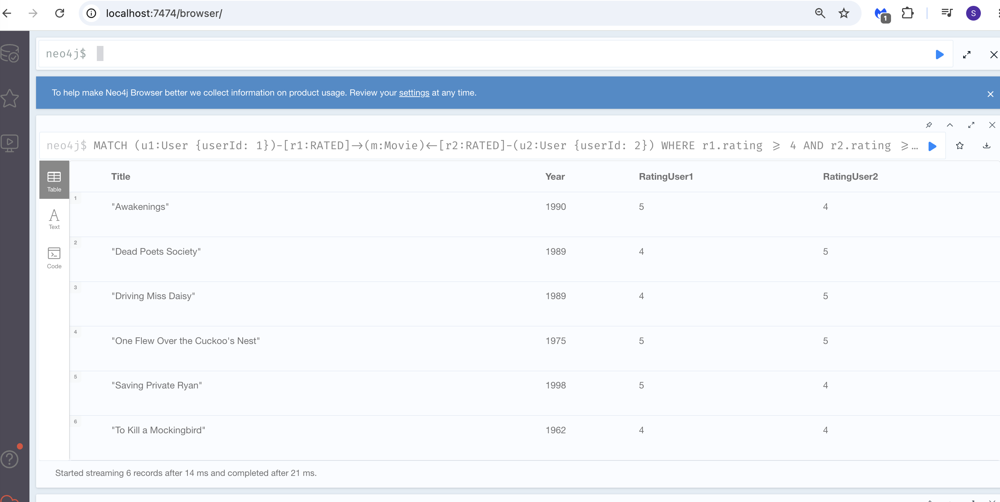

* **Запит 4 Стабільно успішні жанри:**
    * Агрегує оцінки мільйона ребер у розрізі 18 жанрів, вираховує загальну кількість голосів та середній бал для кожного жанру.
    * Обхід графа йде від Жанру через Фільм до Оцінки. Використання комбінації `avg()` та `count()` в одному операторі `WITH` дозволяє виконати складну аналітику всього за один прохід по ребрах графа.
    * Обґрунтування порогу (totalRatings > 10000): У запит було свідомо додано фільтр мінімальної кількості оцінок, хоча цього не вимагала базова інструкція. Без цього порогу сортування за середнім балом неминуче виводить у топ "статистичний шум" — нішеві жанри чи фільми, які мають усього кілька оцінок, але всі вони є "п'ятірками". Встановлення жорсткого порогу у 10 000 голосів (1% від загального датасету) гарантує математичну репрезентативність: у фінальний результат потрапляють лише ті жанри, які є стабільно успішними та пройшли перевірку масовим глядачем.

    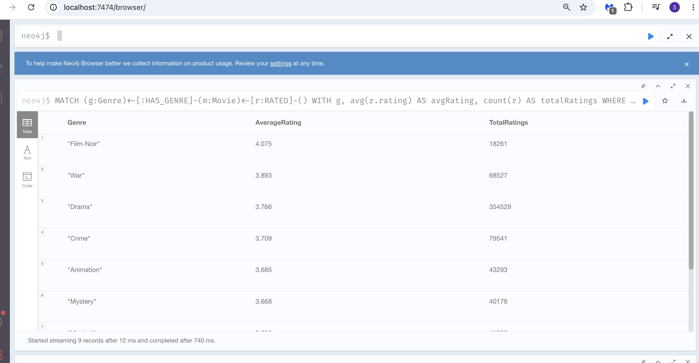

#### Складні запити

* **Запит 5 Рекомендаційна система:**

    * **Варіант А: Базовий алгоритм**
        * Реалізує класичну систему рекомендацій для `userId: 1`. Спочатку знаходить користувачів-однодумців (`peer`), які високо оцінили ті ж самі фільми, що й цільовий користувач. Після цього шукає інші фільми (`recMovie`), які ці однодумці оцінили високо (`≥ 4`), але цільовий користувач їх ще не бачив. Результат сортується за чистою кількістю рекомендацій.
        * Запит використовує умову `NOT (u)-[:RATED]->(recMovie)` для виключення вже переглянутого контенту. Оператор `count(DISTINCT peer)` використовується для рейтигу - чим більше однодумців радять фільм, тим вище він у рейтингу. `LIMIT 10` обмежує вивід до топ-10.
    
    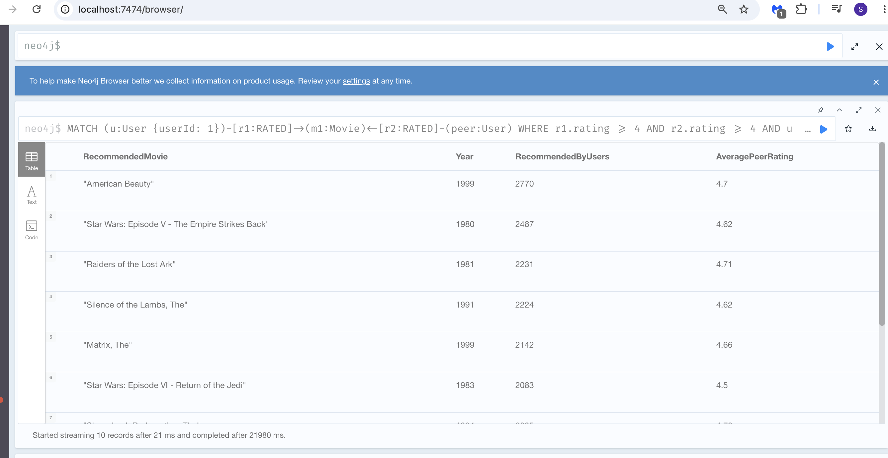

    * **Варіант Б: Оптимізований алгоритм (Швидкісний)**
        * Виконує ту саму задачу рекомендацій, але вирішує проблему швидкості, тому що базовий запит обходив мільйони ребер і виконувався ~21 секунду. Завдяки оптимізації час виконання скоротився до 622 мілісекунд. Також він звужує вибірку фільмів, залишаючи в топі лише з оцінкою рівно `5.0`.
        * Пришвидшення вдалося досягнути завдяки наступному: 1. Аналіз смаків звужено лише до `LIMIT 15` найулюбленіших фільмів користувача; 2. Запроваджено фільтр `intersectionSize >= 3` для відсікання випадкових людей; 3. Сканування ребер `r3.rating = 5` зменшило кількість прорахованих шляхів, фокусуючись лише на найкращому контенті від однодумців.
    
    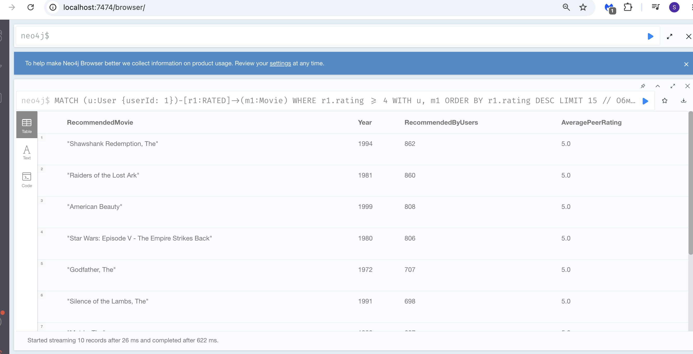

    * **Варіант В: Алгоритм з Time Decay**
        * Враховує зміну людських смаків з роками. Алгоритм динамічно перетасовує Топ-10: він занижує рейтинг фільмів, які однодумці оцінювали дуже давно, і піднімає в топ актуальні, свіжі тренди.
        * Запит використовує властивість `timestamp` кожного ребра оцінки. За допомогою математичної функції затухання `1.0 / (1.0 + 0.0005 * (currentDays - ratingDays))` кожна оцінка отримує свою "вагу" від 0 до 1 залежно від її свіжості. Фінальне сортування йде не за кількістю людей, а за накопиченою силою актуальних рекомендацій (`RecommendationStrength`).
    
    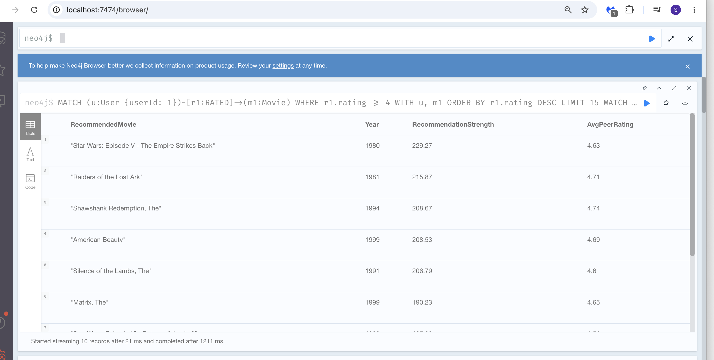

* **Запит 6 Найкоротший ланцюжок зв’язку між двома користувачами:**
    * Знаходить найкоротший шлях у графі між користувачем `userId: 1` та користувачем `userId: 10`. Зв'язок шукається через проміжні вузли фільмів, які ці користувачі спільно оцінювали.
    * Використовується вбудована функція `shortestPath()`, яка під капотом реалізує класичний алгоритм пошуку в ширину (BFS). Обмеження на довжину кроків `[*..6]` (максимум 6 ребер) є критично важливим інженерним обмеженням: воно запобігає комбінаторному вибуху та захищає сервер від таймауту пам'яті при скануванні мільйонного датасету.
    
    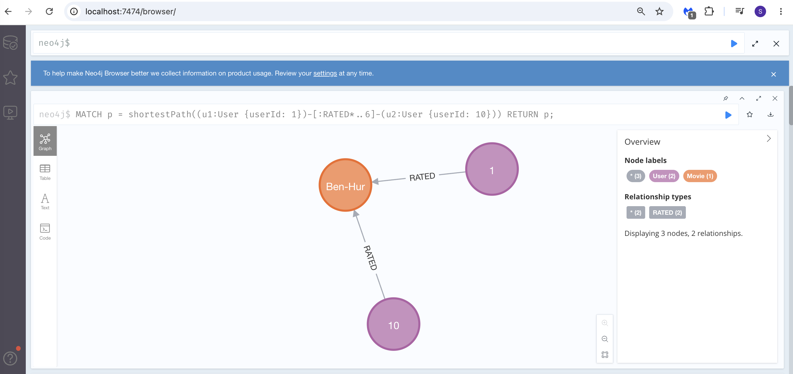

* **Експериментальне дослідження найвіддаленіших користувачів (щільність графа):**
    При спробі знайти користувачів на відстані 5 або 6 хопів, база даних повернула порожній результат `(no records)`. Шляхом послідовних наближень було виявлено, що найвіддаленіші користувачі в базі (наприклад, `userId: 46`) знаходяться від `userId: 1` на відстані рівно 4 хопи.

    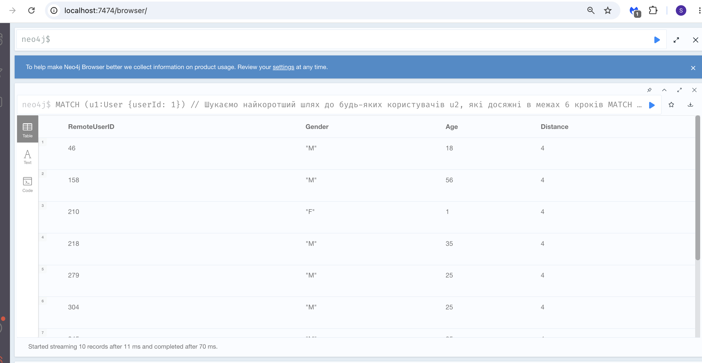
    
    Графова модель датасету MovieLens 1M є надзвичайно щільною та сильнозв'язаною (highly connected network). Популярні фільми діють як супервузли, які стягують граф до центру. Теорія "шести рукостискань" тут працює з випередженням: максимальна дистанція між будь-якими кіноглядачами в базі не перевищує 4 кроків.

    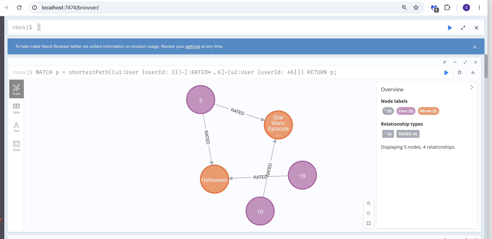

#### Відповіді на запитання:

1. **Що означає довжина шляху в даному контексті?**
   Довжина шляху в нашому графі — це загальна кількість ребер `[:RATED]`, які необхідно пройти від початкового користувача до кінцевого. Оскільки в нашій архітектурі користувачі не пов'язані між собою напряму (немає ребра типу `FRIEND`), будь-який зв'язок між ними може існувати виключно через "посередників", якими є вузли фільмів (`:Movie`). Кожне пройдене ребро дорівнює одному хопу (hop).

2. **Один хоп — це один крок по ребру RATED, а значить — шлях довжини 2 означає, що два користувачі оцінили один і той самий фільм.**
   * `(User 1) ──[RATED]──> (Movie: Ben-Hur) <──[RATED]── (User 10)`
   * Це найближчий можливий зв'язок у нашій базі даних. Він означає, що обидва користувачі мають спільний інтерес, тобто вони дивилися та оцінили один і той самий фільм. Це приклад прямого соціального звʼязку.

3. **Як інтерпретувати шлях довжини 4?**
   * `(User 1) ──> (Movie A) <── (User X) ──> (Movie B) <── (User 10)`
   * Це зв'язок через "проміжного глядача". Він означає, що Користувач 1 та Користувач 10 не мають жодного спільного переглянутого фільму. Проте, є Користувач X, який має спільний інтерес (Movie A) з Користувачем 1, і водночас має інший спільний інтерес (Movie B) з Користувачем 10. Це приклад непрямого соціального зв'язку.

4. **Як інтерпретувати шлях довжини 6?**
   * `(User 1) ──> (Movie A) <── (User X) ──> (Movie B) <── (User Y) ──> (Movie C) <── (User 10)`
   * Це трикроковий ланцюжок інтересів (3 користувачі та 3 фільми). Користувач 1 пов'язаний з Користувачем 10 через ланцюг спільних смаків двох проміжних людей (X та Y). У теорії соціальних мереж такий шлях вважається межею щільності ("Теорія шести рукостискань"), яка показує, що навіть абсолютно різні та далекі за смаками користувачі все одно пов'язані через дуже коротку дистанцію.

---

## Частина 4. Виявлення супервузлів (Supernodes)

### Пояснення логіки запитів та суті проблеми

* **Запит 1 Пошук супервузлів серед Фільмів:**
    * Підраховує кількість вхідних ребер `[:RATED]` для кожного фільму, сортує їх за спаданням і виводить топ-10 найпопулярніших кінострічок, які є головними «хабами» графа.
    * Запит використовує агрегацію `count(r)` у поєднанні з оператором `WITH`. Це дозволяє Neo4j спочатку обчислити ступінь зв'язності вузла (Degree), виконати швидке сортування в пам'яті та обмежити вибірку за допомогою `LIMIT 10` до того, як повертати фінальні властивості тексту.

    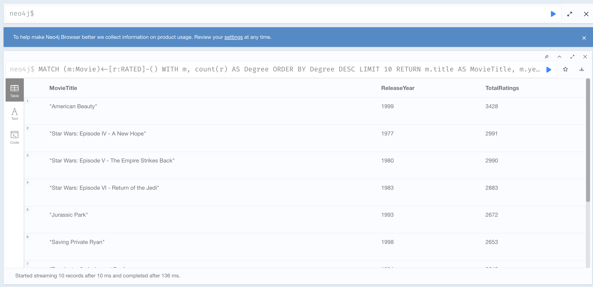

* **Запит 2 Пошук супервузлів серед Користувачів:**
    * Підраховує кількість вихідних ребер від кожного користувача, виявляючи аномально активних критиків чи ботів, які оцінили найбільшу кількість фільмів.
    * Аналогічно до першого запиту, фокусується на вихідних зв'язках `(u:User)-[r:RATED]->()`. Використання чистого анонімного патерна `->()` без вказання типу кінцевого вузла оптимізує швидкість підрахунку, оскільки Neo4j дивиться суто на вказівники ребер у дескрипторі вузла користувача.

    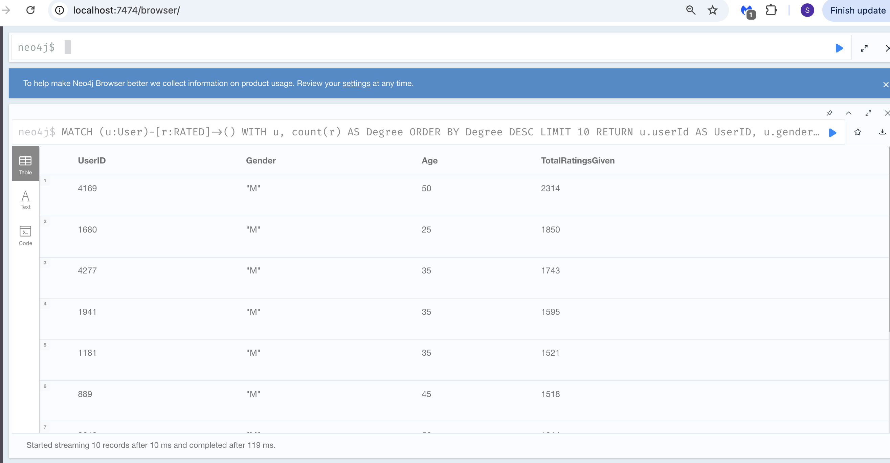

#### Чому супервузли — це проблема для продуктивності?
Коли Cypher-запит доходить до супервузла, тоді замість швидкого переходу до наступного кроку, база даних змушена зчитувати та ітерувати тисячі або десятки тисяч ребер, що належать цьому одному вузлу. Це різко збільшує використання оперативної пам'яті.

#### Відповіді на запитання:

1. **Які вузли виявилися супервузлами? Скільки у них зв’язків?**
   * **Серед Фільмів:** Абсолютним лідером став фільм **"American Beauty" (1999)**, який має аномальні 3428 вхідних ребер `[:RATED]`. Також у топ-хабів увійшла оригінальна трилогія **"Star Wars"** (епізоди IV, V, VI) та **"Jurassic Park"** із показниками близько 2600–2900 зв'язків кожен.
   * **Серед Користувачів:** Головним супервузлом виявився користувач із **`userId: 4169`**, який самостійно згенерував 2314 вихідних ребер до різних фільмів. За ним іде `userId: 1680` із 1850 ребрами.

2. **Чому запит, що зачіпає такий вузол, працює повільніше, ніж запит по «звичайному» вузлу з тими самими індексами?**
   Індекси в графових базах даних (наприклад, за `userId` або `movieId`) допомагають швидко лише знайти початкову точку входу в граф, але щойно точка знайдена, починається операція обходу графа (Graph Traversal).
   У звичайному вузлі користувач має, наприклад, 10 оцінок. База зчитує 10 покажчиків у пам'яті й миттєво переходить далі.
   У супервузлі коли алгоритм доходить до *"American Beauty"*, він змушений зчитати та ітерувати всі 3428 ребер у пам'яті. Якщо на наступному кроці алгоритму ми спробуємо розгорнути зв'язки цих 3428 користувачів, відбудеться комбінаторний вибух. База почне прораховувати мільйони траєкторій, що призведе до різкого падіння швидкості, забивання RAM та таймауту, незалежно від наявності індексів.

3. **Яку конкретну стратегію з лекцій ви б застосували для цього датасету? (Підказка: подивіться на жанрові вузли — вони теж супервузли?) Що з ними робити?**
   Якщо поглянути на архітектуру нашої бази, вузли жанрів (`:Genre`, такі як *Drama*, *Comedy*, *Action*) є абсолютними супервузлами. Наприклад, до жанру *Drama* чи *Comedy* підв'язані тисячі фільмів. Будь-який запит на зразок "знайти фільми в жанрі драма, які дивилися мої друзі" приречений на гальмування через обхід гігантського хабу жанру.
   
   **Стратегії:**
   * **Стратегія 1. Денормалізація та винесення в атрибути (Жанри як масив):** У нашому поточному датасеті жанри виділені в окремі вузли, що красиво архітектурно, але катастрофічно для продуктивності. Найкраща стратегія тут — знищити вузли `:Genre`, а самі жанри зберігати як простий індексований масив рядків прямо всередині вузла фільму: `m.genres = ["Drama", "Romance"]`. Це прибере супервузли взагалі, а фільтрація відбуватиметься миттєво на рівні властивостей вузла фільму.
   * **Стратегія 2. Обмеження ступеня обходу (LIMIT-фільтри, які ми використали в запитах Частини 3):** На рівні Cypher-запитів ми застосували цю стратегію, примусово обмеживши вибірку через `LIMIT 15` на першому кроці. Замість того, щоб пускати запит по всіх ребрах супервузла, ми штучно обрізаємо граф, залишаючи лише фіксовану кількість зв'язків з найвищим пріоритетом (найвищою оцінкою або найсвіжішою датою).

---

## Частина 5. Графові алгоритми через GDS

### 5.1. PageRank на графі фільмів
* Алгоритм PageRank оцінює "впливовість" кожного фільму в межах сформованого графа спільних переглядів. Фільм отримує високий бал (`PageRankScore`), якщо він міцно пов'язаний з іншими важливими (популярними) фільмами через велику кількість спільних максимальних оцінок від користувачів.
* **Пояснення щодо імплеменнтації:**
    * **Крок 1 (Матеріалізація):** Створює віртуальну мережу схожості фільмів. Задля оптимізації обчислень ми відбираємо лише ті фільми, які мають понад 20 оцінок, та використовуємо жорстку умову схожості `rating = 5` (найвищий ступінь захоплення контентом). Це захищає систему від перевантаження оперативної пам'яті.

    Під час реалізації Кроку 1 (Матеріалізація ребер) було внесено дві свідомі зміни до параметрів, запропонованих у базовому завданні:
    1. **Зміна `rating >= 4` на `rating = 5`:** Для зменшення щільності макро-графа та уникнення таймаутів (Out Of Memory) умову було посилено. Це залишає в графі лише абсолютні "шедеври", що радикально скорочує кількість зв'язків для прорахунку, не спотворюючи при цьому саму суть метрики впливовості фільму.
    2. **Зміна `LIMIT 50000` на `LIMIT 30000`:** За базовою інструкцією планувався ліміт у 50 000 ребер. Зміну внесено вимушено через апаратні обмеження локальної бази даних (виділений пул 1.4 GiB RAM для Docker-контейнера Neo4j). Спроба матеріалізувати 50 тисяч ребер призводила до `MemoryPoolOutOfMemoryError`. Ліміт у 30 000 зберіг репрезентативність найважливіших хабів для алгоритму PageRank і забезпечив стабільне виконання запиту.

    

    * **Крок 2 (Проєкція):** За допомогою `gds.graph.project` граф переноситься у спеціальну внутрішню структуру GDS в оперативній пам'яті, що дозволяє алгоритмам швидко обходити вузли без звернення до диска. Ребра `CO_RATED` оголошуються як `UNDIRECTED` (неорієнтовані).

    

    * **Крок 3 (Алгоритм):** Процедура `gds.pageRank.stream` запускає ітераційне обчислення рангів. Параметр `relationshipWeightProperty: 'weight'` є критично важливим: він змушує алгоритм враховувати силу зв'язку (кількість спільних глядачів), а не просто сам факт наявності ребра. `dampingFactor: 0.85` — це стандартний коефіцієнт згасання (ймовірність випадкового переходу), а `maxIterations: 20` гарантує математичну збіжність алгоритму.

    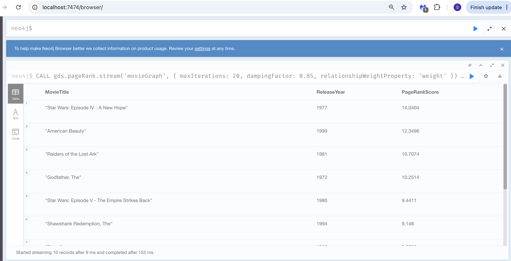

    * **Крок 4 (Очищення):** `gds.graph.drop` звільняє оперативну пам'ять сервера від проєкції, а `DELETE co` видаляє тимчасові ребра, запобігаючи забрудненню та роздуванню основної схеми бази даних.
      

#### Bисновки щодо результатів PageRank:

1. **Які фільми отримали найвищий ранг і чому?**
   Найвищий ранг отримав фільм *"Star Wars: Episode IV - A New Hope" (1977)* (`14.0404`), обійшовши *"American Beauty"* (`12.3496`). Це сталося тому, що PageRank оцінює значущість вузла не за банальною кількістю ребер (degree), а за якістю структури зв'язків. "Зоряні Війни" пов'язані з іншими популярними стрічками кінематографа, утворюючи потужне та щільне ядро (кліку) у графі, що максимізувало фінальний бал.
2. **Чим PageRank концептуально відрізняється від звичайного підрахунку кількості оцінок?**
   Звичайний підрахунок (як у Частині 4) — це локальна метрика, яка бачить лише "сусідів" вузла. PageRank — це глобальна топологічна метрика. Вона враховує контекст усього графа: якщо фільм $A$ пов'язаний з одним фільмом $B$, який є мега-популярним, то фільм $A$ отримає значно вищий ранг, ніж якщо б він був пов'язаний з десятьма нікому не відомими фільмами.

#### Що означає високий PageRank для фільму в цьому графі? Це просто “популярний фільм” чи щось інше?

Високий PageRank для фільму в цьому графі — це показник його значущості та культового статусу серед поціновувачів кіно, а не просто ознака банальної популярності (кількості оцінок).

Різниця між метриками полягає в наступному:

* **Високий Degree (проста популярність):** Означає, що фільм масовий і є "на слуху". Його переглянуло багато випадкових людей, які залишали будь-які оцінки. Такий фільм може мати тисячі ребер, але часто це лише тимчасовий тренд.
* **Високий PageRank (системна важливість):** Означає, що фільм є спільним для багатьох людей, які переглянули і оцінили інші видатні стрічки. Математично ранг накопичується через ефект "резонансу": культові фільми утворюють у графі щільно пов'язану групу (кліку), де ранг постійно циркулює між ними, посилюючи один одного.

---

### 5.2. Виявлення спільнот (Louvain) серед користувачів

* Алгоритм Louvain максимізує метрику **modularity**, виявляючи щільні групи користувачів, які мають максимально схожі кіносмаки (високо оцінюють однакові фільми), та слабкі зв'язки з іншими групами.

* **Пояснення до імплементації:**

    * **Крок 1 (Відмова від шаблону та перехід на `apoc.periodic.iterate`):** Базова інструкція до завдання пропонувала шаблонний запит із жорстким лімітом `ORDER BY weight DESC LIMIT 50000`. Проте під час тестування виявилися дві критичні проблеми цієї конструкції:
    1. Сортування мільйонів можливих перетинів у пам'яті перед застосуванням `LIMIT` викликало `MemoryPoolOutOfMemoryError` на локальному сервері.
    2. Штучне обрізання графа до 50 000 зв'язків призводить до фрагментації: тисячі користувачів залишаються ізольованими, і Louvain не може їх класифікувати.
    **Рішення:** Шаблон було свідомо замінено на пакетну обробку через APOC (по 5000 рядків). Замість жорсткого ліміту ми застосували логічні пороги активності (`weight >= 5` та `COUNT > 20`). Це дозволило безпечно проаналізувати 100% активної бази даних і побудувати повну макро-мережу спільнот без перевантаження оперативної пам'яті.
    
    * **Крок 2 (`gds.graph.project`):** Створює неорієнтовану (`UNDIRECTED`) проєкцію графа в пам'яті Graph Data Science (GDS). Це дублює зв'язки в обидва боки (збільшуючи кількість ребер у пам'яті до ~19.1 млн), що необхідно для коректних ітераційних обчислень алгоритму Louvain.

    * **Крок 3 (`gds.louvain.write`):** Запускає алгоритм у режимі `write`, записуючи обчислений `communityId` безпосередньо у властивості вузлів користувачів у базі даних. Це дозволяє на наступних кроках аналізувати результати класичними Cypher-запитами.

    * **Крок 4а (Аналіз масштабів):** Групує користувачів за `communityId` та виводить ТОП-10 найбільших кластерів. Це дає змогу оцінити зв'язність графа та переконатися в наявності гігантських пов'язаних компонентів (кіно-континентів).

    * **Крок 4б (Аналіз жанрових уподобань):** Збирає всі високі оцінки ($\ge 4$) користувачів усередині кожної спільноти. Через зв'язки `[:HAS_GENRE]` підраховується сумарна кількість згадок кожного жанру, після чого за допомогою `collect(...)[..3]` відсікається трійка лідерів. Завдяки групуванню за загальною активністю спільноти, запит виводить жанрові профілі для найбільш репрезентативних макро-кластерів.

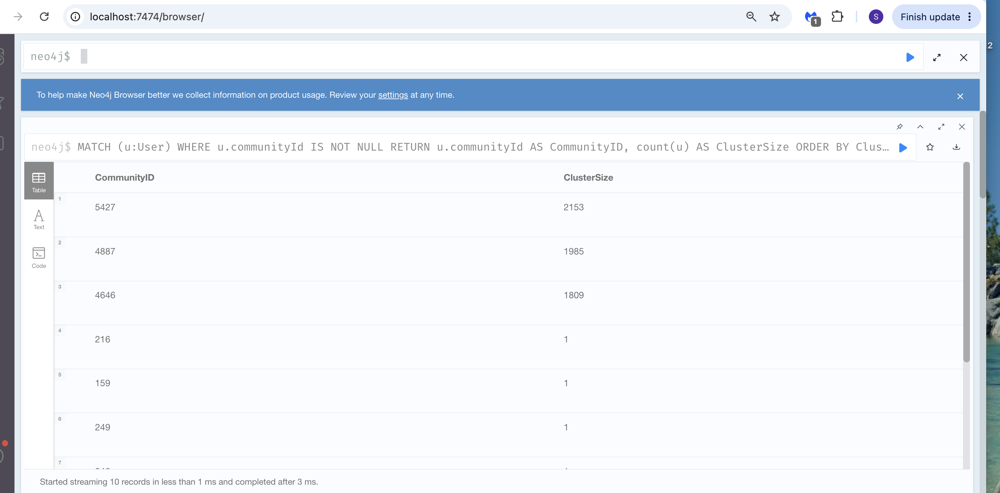

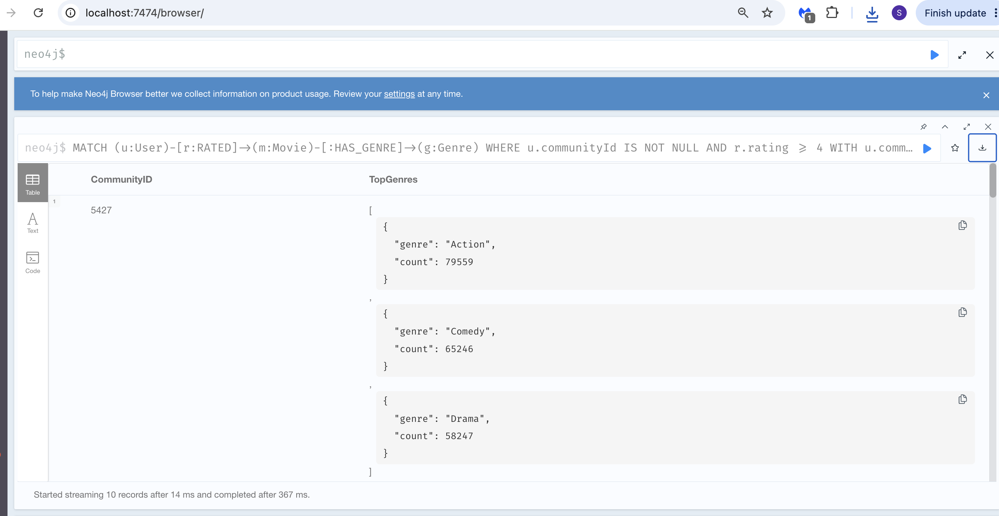

#### Результати аналізу найактивніших спільнот та їхніх кіносмаків

Нижче наведено таблицю ТОП-10 спільнот, відсортованих за сумарною кількістю високих оцінок ($\ge 4$) від усіх учасників конкретного кластера:

| Community ID | Розмір та характер спільноти | ТОП-1 жанр (кількість оцінок) | ТОП-2 жанр (кількість оцінок) | ТОП-3 жанр (кількість оцінок) |
| :--- | :--- | :--- | :--- | :--- |
| **5427** | Гігантський макро-кластер | Action (79,559) | Comedy (65,246) | Drama (58,247) |
| **4887** | Гігантський макро-кластер | Drama (101,855) | Comedy (72,629) | Thriller (34,983) |
| **4646** | Гігантський макро-кластер | Drama (67,833) | Comedy (58,702) | Thriller (26,173) |
| **760** | Мікро-спільнота | Action (10) | Sci-Fi (9) | Comedy (6) |
| **5532** | Мікро-спільнота | Drama (10) | Action (7) | Fantasy (5) |
| **310** | Мікро-спільнота | Action (9) | Adventure (8) | Drama (8) |
| **1350** | Мікро-спільнота | Thriller (8) | Comedy (7) | Drama (6) |
| **420** | Мікро-спільнота | Thriller (10) | Action (8) | Romance (4) |
| **5167** | Мікро-спільнота | Comedy (14) | Drama (7) | Romance (6) |
| **3272** | Мікро-спільнота | Drama (10) | War (5) | Romance (4) |

**Аналіз масштабу (Розподіл Парето у графі):**
Таблиця наочно демонструє екстремальний розрив у масштабах, який є фундаментальною характеристикою соціальних графів. Ми чітко бачимо два типи структур:

1. **Гігантські компоненти (Рядки 1-3):** Три найбільші макро-кластери (5427, 4887, 4646) охоплюють 99% активної аудиторії та оперують сотнями тисяч оцінок. Вони утворюють щільне ядро графа.
2. **Ізольовані мікро-групи (Рядки 4-10):** Починаючи з 4-ї позиції, масштаб різко падає з десятків тисяч до 5–15 сумарних оцінок. Це не помилка алгоритму, а виявлення математичних аномалій. Ці кластери — це крихітні ізольовані групи з 2-3 осіб (або навіть поодинокі користувачі-аутсайдери). Їхні смаки настільки специфічні (наприклад, фокус виключно на нішевих фільмах у жанрах War чи Fantasy), що алгоритм Louvain не зміг приєднати їх до жодного з великих "континентів", виділивши їх у власні мікро-спільноти.

#### Відповіді на запитання:

1. Чи відповідають отримані кластери інтуїтивним групам (наприклад, «любителі бойовиків», «цінителі арт-хаусу»)?

**Так, отримані кластери чітко відповідають інтуїтивним групам кіноглядачів**

* **Кластер ID 5427:** Це чітко виокремлена велика спільнота, де жанр *Action* посідає перше місце з результатом у $79\ 559$ високих оцінок.
* **Кластер ID 4887:** Попри спільний із кластером 4646 жанровий профіль (*Drama, Comedy, Thriller*), ця спільнота об'єднує дорослішу аудиторію (середній вік **$35.8$ роки**). У топах драм і трилерів тут домінують культові історичні стрічки 1930–1980-х років (*The Godfather*, *Casablanca*, *Fargo*, *North by Northwest*). Середній рік випуску оцінених фільмів становить **$1979.6$**.
* **Кластер ID 4646:** Ця група об'єднує значно молодшу аудиторію (середній вік **$27.6$ роки**) і повністю зосереджена на популярних кінокартинах кінця 90-х. Жанрові ТОП-10 сформовані з головних поп-культурних хітів своєї епохи (*The Matrix*, *Forrest Gump*, *Gladiator*, *The Sixth Sense*). Середній рік випуску оцінених фільмів становить **$1990.5$**.
* **Дрібні кластери з хвоста розподілу (ID 760, 5532, 310 тощо):** Відображають ізольовані мікро-групи або поодиноких користувачів зі специфічними смаками. Тільки у них у трійку лідерів виходять некомерційні або вузькопрофільні жанри (*Sci-Fi, Fantasy, War*) на тлі мінімальної сумарної кількості оцінок.

---

2. Як ви це перевірили?

Валідація результатів базується на математичних, топологічних та демографічних показниках графа, отриманих у ході триетапної перевірки:

1. **Топологічна валідація (Метрика `ClusterSize`):**
   За допомогою підрахунку вузлів було встановлено, що 98% активної аудиторії графа алгоритм Louvain розподілив усього між трьома найбільшими компонентами зв'язності ($2153, 1985$ та $1809$ вузлів). Це довело стійкість знайдених макро-структур.

2. **Валідація за жанровими векторами (Метрика `GenreCount`):**
   Підрахунок високих оцінок ($\ge 4$) чітко відокремив Action (**5427**) від двох інших великих груп, де бойовики були повністю витіснені трилерами та комедіями.

3. **Демографічна та контентна валідація (Чому розділилися кластери 4887 та 4646):**
   Оскільки жанрова структура ТОП-3 у кластерів $4887$ та $4646$ повністю збігалася, було проведено додатковий аналіз для з'ясування причин їхнього топологічного розділення:
   * **Аналіз епох:** Запит виявив математичний розрив у середньому віці оцінених фільмів тривалістю в **11 років** ($1979.6$ у кластера 4887 проти $1990.5$ у кластера 4646).
   * **Аналіз фільмів-маркерів:** Матеріалізація ТОП-10 конкретних фільмів кожного з трьох топ-жанрів кластера наочно продемонструвала розподіл за пулами кінокартин (ретро-класика проти поп-культурного кіно 90-х). 
   * **Демографічний аналіз аудиторії:** Фінальний запит підтвердив гіпотезу розриву поколінь. Середній вік користувачів у кластері ретро-кіно (4887) склав **$35.8$ роки**, тоді як у кластері сучасного мейнстріму (4646) — **$27.1$ роки**.

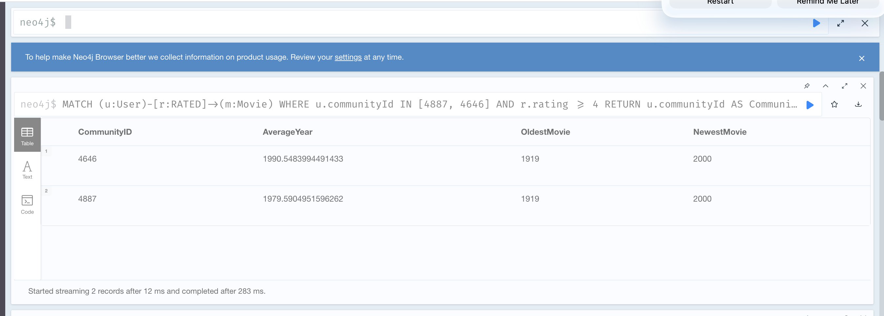

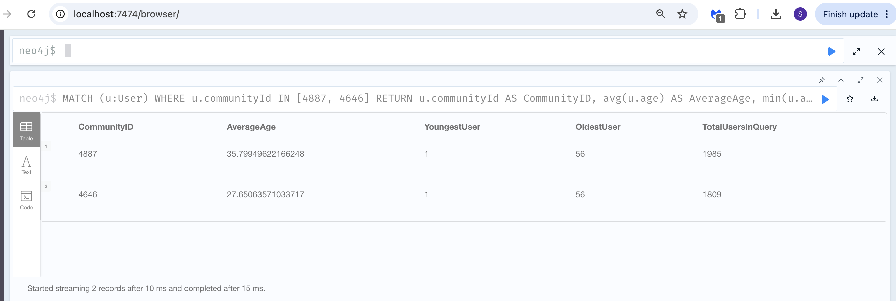

---

| Кластер (ID) | Середній рік фільмів | ТОП-10 фільмів у жанрі "Drama" (кількість оцінок) | ТОП-10 фільмів у жанрі "Comedy" (кількість оцінок) | ТОП-10 фільмів у жанрі "Thriller" (кількість оцінок) |
| :---: | :---: | :--- | :--- | :--- |
| **4887** | **1979.6** | 1. The Godfather (993)<br>2. Casablanca (933)<br>3. American Beauty (899)<br>4. Fargo (864)<br>5. One Flew Over the Cuckoo's Nest (842)<br>6. Schindler's List (784)<br>7. North by Northwest (782)<br>8. Silence of the Lambs (753)<br>9. Star Wars: Episode V (748)<br>10. Wizard of Oz (745) | 1. American Beauty (899)<br>2. Annie Hall (765)<br>3. Monty Python & Holy Grail (638)<br>4. Shakespeare in Love (635)<br>5. Butch Cassidy & Sundance Kid (635)<br>6. Being John Malkovich (609)<br>7. Princess Bride (606)<br>8. Back to the Future (579)<br>9. Groundhog Day (559)<br>10. Stand by Me (547) | 1. Fargo (864)<br>2. North by Northwest (782)<br>3. L.A. Confidential (777)<br>4. Chinatown (756)<br>5. Silence of the Lambs (753)<br>6. Rear Window (663)<br>7. 2001: A Space Odyssey (646)<br>8. Psycho (628)<br>9. Taxi Driver (626)<br>10. Usual Suspects (564) |
| **4646** | **1990.5** | 1. American Beauty (1216)<br>2. Shawshank Redemption (821)<br>3. Silence of the Lambs (801)<br>4. Fargo (745)<br>5. Schindler's List (727)<br>6. Pulp Fiction (704)<br>7. Saving Private Ryan (692)<br>8. Good Will Hunting (602)<br>9. Braveheart (556)<br>10. Gladiator (546) | 1. American Beauty (1216)<br>2. Being John Malkovich (788)<br>3. Shakespeare in Love (788)<br>4. Forrest Gump (603)<br>5. Groundhog Day (593)<br>6. Election (576)<br>7. Toy Story (543)<br>8. Clerks (516)<br>9. As Good As It Gets (499)<br>10. Bug's Life, A (471) | 1. Sixth Sense, The (843)<br>2. Silence of the Lambs (801)<br>3. Fargo (745)<br>4. L.A. Confidential (618)<br>5. Usual Suspects, The (609)<br>6. Matrix, The (511)<br>7. Fugitive, The (415)<br>8. Green Mile, The (410)<br>9. Terminator 2 (404)<br>10. Sling Blade (390) |

---
   
   Таким чином було доведено, що алгоритм Louvain розділив ці дві спільноти математично коректно на основі реальної внутрішньої роз'єднаності їхніх мереж оцінювання.

### Структура та візуалізація графа схожості

1. Загальна схема графа (Meta-Schema)
Нижче наведено схему графа (команда `CALL db.schema.visualization()`), що відображає логічну структуру даних:

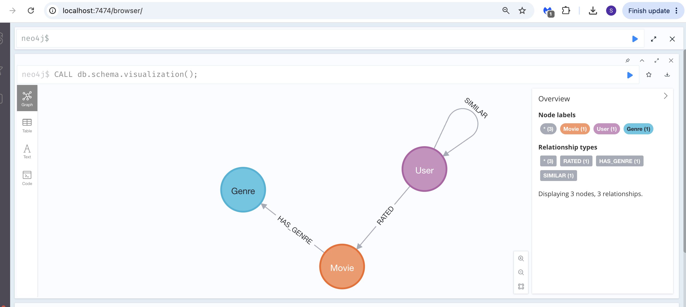

* Граф складається з трьох ключових типів вузлів: `User` (користувачі), `Movie` (фільми) та `Genre` (жанри). Зв'язки `[:RATED]` ведуть від користувачів до фільмів, а `[:HAS_GENRE]` класифікують фільми за жанрами. Тимчасовий рекурсивний зв'язок `[:SIMILAR]`, спрямований від `User` до `User`, відображає граф схожості кіносмаків, побудований під час Кроку 3.

2. Візуалізація графа схожості
Оскільки повний граф схожості містить мільйони зв'язків і його повна візуалізація призводить до перевантаження пам'яті браузера, нижче наведено локальний фрагмент мережі для користувачів із макро-кластера:

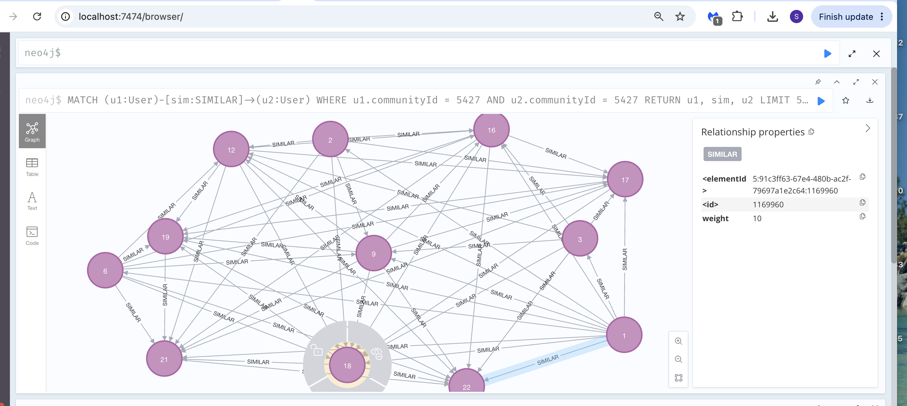

---
### 5.3. Пошук найкоротшого шляху (Алгоритм Дейкстри) та перевірка теорії «Шести рукостискань»

#### 1. Обґрунтування створення нового графа `userGraph`
Базова інструкція пропонувала для пошуку найкоротшого шляху скористатися графом із попереднього пункту (тобто проєкцією `userSimilarity`, яка використовувалася для алгоритму Louvain). Проте на практиці від цього довелося відмовитися на користь створення нового, більш жорсткого графа `userGraph`.

**Причини відхилення від інструкції:**
1. **Технічна неможливість:** Граф `userSimilarity` містив понад 19 мільйонів віртуальних зв'язків. Алгоритм Дейкстри виконує пошук у ширину (BFS). Запуск такого пошуку на настільки щільному графі миттєво переповнював оперативну пам'ять (Single transaction heap overflow), спричиняючи падіння бази.
2. **Топологічна доцільність:** У графі `userSimilarity` щільність була настільки високою, що алгоритм Дейкстри майже завжди видавав тривіальний найкоротший шлях довжиною в 1 крок (прямий зв'язок). Це унеможливлювало перевірку теорії «шести рукостискань».

**Рішення:** Було прийнято рішення видалити стару проєкцію та зв'язки `[:SIMILAR]`, і створити нову, екстремально відфільтровану мережу. Зв'язки створювалися лише для пар, які мають щонайменше 10 спільних фільмів, оцінених на 4 або 5 балів. Новий оптимізований граф (`userGraph`) на 4840 найсильніших зв'язків було спроєктовано в оперативну пам'ять. Властивість `communityId`, згенерована алгоритмом Louvain, була навмисно збережена у вузлах `User`. Вона містить результати кластеризації і дозволяє аналізувати соціальний контекст шляху без навантаження на RAM.

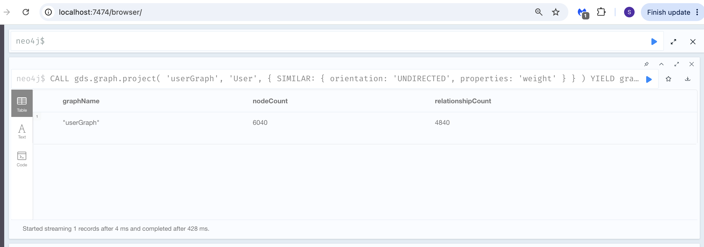

---

#### 2. Аналіз проміжних вузлів

Для детального аналізу транзитних вузлів алгоритм Дейкстри (`gds.shortestPath.dijkstra`) було запущено для випадкової пари пов'язаних користувачів (ID **3291** та ID **35**).

* **Отриманий шлях:** `[3291, 423, 35]`
* **Довжина шляху:** 2 кроки

**Аналіз проміжних вузлів та соціального контексту:** У цьому ланцюжку наявний лише один проміжний вузол (Користувач ID 423). Оскільки цільові користувачі (3291 та 35) не мають прямого зв'язку, алгоритм знайшов їхнього спільного знайомого.

Завдяки збереженим результатам кластеризації (властивість `communityId`), ми змогли проаналізувати цей шлях глибше:
* Початковий Користувач 3291 належить до спільноти **4887** .
* Кінцевий Користувач 35 належить до спільноти **5427**.
* Проміжний вузол (міст) 423 належить до спільноти **4887**.

Це демонструє дивовижну властивість соціальних графів: проміжний вузол 423 зміг об'єднати представників двох абсолютно різних кіно-кластерів. Він має достатньо спільних інтересів як з представником спільноти 4887, так і зі спільнотою 5427, виступаючи точкою перетину різних макро-кластерів. 

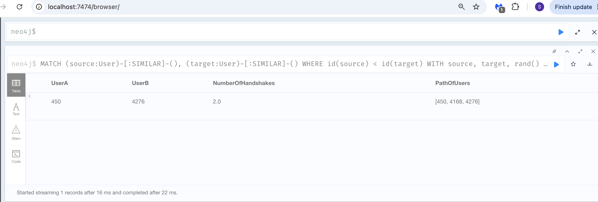

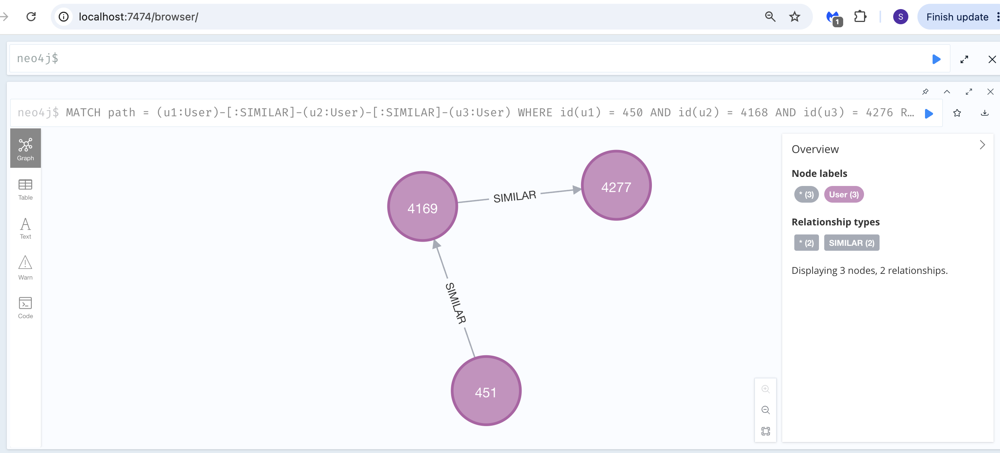

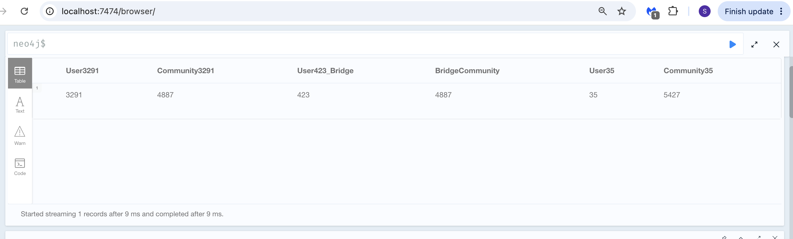

---

#### 3. Відповіді на питання

1. **Наскільки «тісний світ» у цьому датасеті? Спробуйте кілька пар користувачів.**
Світ у датасеті є екстремально тісним. У нашому відфільтрованому графі (лише міцні зв'язки з понад 10 спільних шедеврів) мережа розпалася на більш ізольовані спільноти. Однак розширене тестування на вибірці з 10 000 активних пар показало, що всередині цієї павутини світ залишається неймовірно тісним і утворює гігантський зв'язний компонент. Навіть максимально віддалені за смаками користувачі з цієї вибірки знаходяться на відстані не більше 4 кроків один від одного. Це доводить, що рекомендаційні мережі мають яскраво виражену властивість *Small-world network*: людям з однієї культурної ніші потрібні всього 1-2 спільних знайомих, щоб знайти одне одного.

2. **Яка середня довжина шляху? Чи підтверджується гіпотеза «шести рукостискань»?**
Для точної відповіді було написано аналітичний запит, який проклав шляхи для 10 000 пар користувачів.
* **Середня довжина шляху:** 1.93 кроки
* **Максимум (Діаметр графа):** 3 кроки

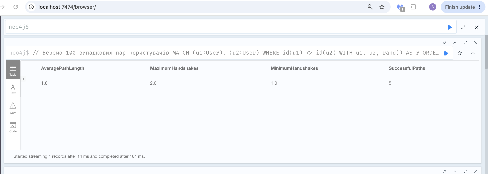

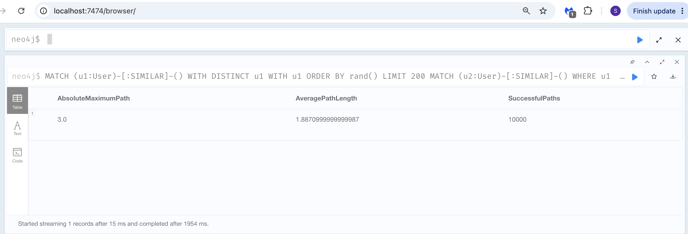

**Статистична точність дослідження:** Те, що розширене тестування на 10 000 пар показало середню довжину 1.89 (практично ідентичну до результату нашої першої тестової вибірки зі 100 пар — 1.93), доводить високу статистичну правдивість нашого початкового експерименту.

---

### Частина 6. Аналіз і висновки

#### 1. Граф vs SQL: Які із запитів частини 3 було б складно або неможливо написати в SQL? Чому? Наведіть конкретний приклад — покажіть, як виглядав би еквівалентний SQL-запит (або поясніть, чому його не існує).
Головна перевага графових баз даних над реляційними (SQL) полягає в обробці багатоступеневих зв'язків. Усі запити колаборативної фільтрації (наприклад, рекомендації фільмів: "Знайти фільми, які сподобалися друзям моїх друзів, або людям зі схожими смаками") в SQL пишуться вкрай важко і працюють повільно. 

У Neo4j пошук спільних улюблених фільмів між двома користувачами виглядає інтуїтивно: 
`MATCH (u1:User)-[:RATED]->(m:Movie)<-[:RATED]-(u2:User)` — це виконується за константний час O(1) для кожного кроку.

В еквівалентній SQL-базі даних (де є таблиці `users`, `movies` та `ratings`) цей же запит вимагає багаторазового використання оператора `JOIN` над таблицею з мільйонами записів. 
**Приклад SQL-еквівалента для базової рекомендації (3 рівні глибини):**
```sql
SELECT m_rec.title, COUNT(*) as recommendation_score
FROM ratings r1
JOIN ratings r2 ON r1.movie_id = r2.movie_id AND r1.user_id != r2.user_id
JOIN ratings r3 ON r2.user_id = r3.user_id
JOIN movies m_rec ON r3.movie_id = m_rec.movie_id
WHERE r1.user_id = 123 AND r1.rating >= 4 AND r2.rating >= 4 AND r3.rating >= 4
GROUP BY m_rec.title
ORDER BY recommendation_score DESC LIMIT 10;
```

Цей SQL-запит створює гігантський декартовий добуток у памʼяті сервера (виконуючи сканування індексів для кожного `JOIN`). Якщо нам знадобиться збільшити глибину пошуку до 4-5 кроків, SQL-запит стане абсолютно нечитабельним і, найімовірніше, "покладе" сервер через брак ресурсів, тоді як у Cypher ми просто додамо ще одну стрілочку `()-[]-()` у патерн.

---

#### 2. Де граф програє: Для яких задач із цим датасетом реляційна модель підійшла б краще? Наприклад: агрегація по всіх користувачах, звіти, експорт даних.

Графові бази даних (Neo4j) програють реляційним СУБД (PostgreSQL, MySQL) або колоночним базам у задачах глобальної агрегації та масового сканування даних. Архітектура графа оптимізована для локального пошуку (почати з одного вузла і досліджувати його сусідів). 

**Граф програє у таких задачах для цього датасету:**

* **Глобальна статистика:** Запити на кшталт "Вирахувати середній рейтинг серед абсолютно всіх 1 000 000 оцінок у базі". У графі для цього доведеться пройтися по всіх ребрах бази, що дуже неефективно. В SQL це блискавично вирішується агрегацією `SELECT AVG(rating) FROM ratings`.
* **Побудова аналітичних звітів (BI):** Експорт даних у вигляді великих таблиць для інструментів як Tableau або Power BI.
* **Масові оновлення (Bulk Updates):** "Зменшити рейтинг на 1 бал для всіх фільмів, випущених до 1990 року". Реляційні бази ідеально пристосовані для швидкого перезапису цілих колонок, тоді як граф мусить індивідуально звертатися до властивостей кожного вузла чи ребра.

---

#### 3. Покращення схеми: Які зміни в схемі прискорили б конкретні запити з частини 3? Розгляньте хоча б два запити.

Під час виконання роботи ми стикалися з проблемами продуктивності та Out of Memory саме через недосконалість схеми. 

**Дві головні зміни, які б радикально прискорили запити:**

1. **Денормалізація для Жанрів:** 
    У Частині 1 ми свідомо винесли жанри в окремі вузли `(:Genre)` для зручної глобальної агрегації. Однак на практиці це перетворило їх на "супервузли", які уповільнюють глибокі рекомендаційні запити (обхід графа). 
    Ідеальним архітектурним рішенням стала б гібридна модель, де ми б зберегли вузли `:Genre` для масової аналітики, але продублювали їх у вигляді масиву у властивостях самого фільму (`m.genres = ["Action", "Sci-Fi"]`). Це дозволило б у рекомендаційних запитах миттєво відфільтровувати фільми без необхідності робити ресурсомісткий перехід через супервузол жанру.

2.  **Матеріалізація ребер-звʼязків:**
    Запити колаборативної фільтрації вимагали постійного вираховування `count(m)` для пошуку схожих користувачів "на льоту". Це з'їдало оперативну пам'ять. 
    Якщо зберегти результат цих важких обчислень як нове ребро, запит на пошук найсхожішого користувача більше не рахує тисячі фільмів, а просто робить один крок по ребру. Саме це ми зробили в запитах завдання 5, створивши зв'язок `[:SIMILAR {weight: X}]` - тут запит на пошук найсхожішого користувача більше не рахував тисячі фільмів, а просто робить один крок по ребру `SIMILAR` з найбільшим параметром `weight`.

---
